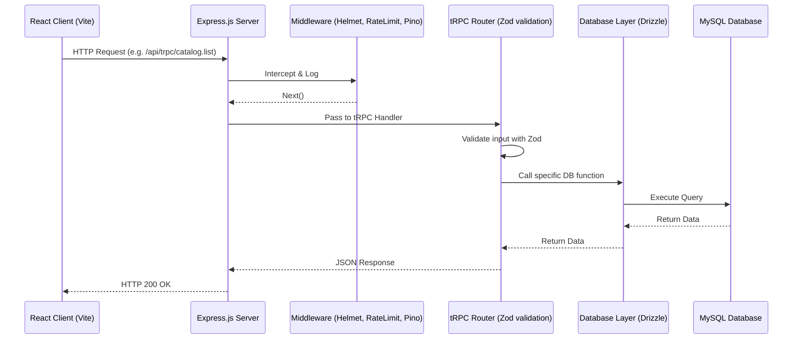

# System Architecture

This document describes the high-level architecture of HSR Digital Hub.

## Request Flow

## Directory Structure
- `/client`: Frontend React application.
- `/server`: Node.js Express backend.
  - `/server/routes`: Domain-specific TRPC routers (e.g., `auth.ts`, `catalog.ts`).
  - `/server/env.ts`: Fail-fast startup configuration using Zod.
  - `/server/logger.ts`: Pino structured JSON logger.
- `/drizzle`: Database schemas and migrations.
- `/shared`: Code shared between client and server (constants, types).

## Security Measures
- **Helmet**: Secures HTTP headers.
- **Express Rate Limit**: Prevents abuse by limiting requests per IP window.
- **Zod Validation**: Strict runtime validation of both environment variables and incoming API requests.
- **Pino-HTTP**: Centralized, structured logging that integrates with monitoring tools.

## Error Handling
Errors thrown within TRPC resolvers are caught by a custom error formatter in `server/_core/trpc.ts`. The error is logged securely using Pino, and a sanitized response is returned to the client to prevent sensitive data leakage.
