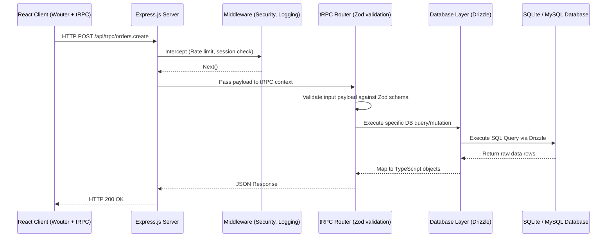

# System Architecture — HSR Digital Hub

This document provides a deep dive into the high-level architecture, request lifecycle, and security models governing the HSR Digital Hub platform.

## 1. High-Level Overview

HSR Digital Hub operates as a "Monolithic Full-Stack" application. While the frontend and backend are logically separated into `/client` and `/server` directories, they run together during development (via Vite middleware) and in production (where Express serves the static React bundle). 

This approach minimizes deployment complexity while maintaining a strict boundary between client state and server-side execution.

## 2. Request Lifecycle

Every API request follows a strict path from the client to the database, ensuring that data is validated, authenticated, and logged at every step.

## 3. Directory & Module Boundaries

Strict module boundaries are enforced to prevent spaghetti code.

- **`/client`**: Pure React code. Never imports anything from `/server`. Connects to the backend strictly via the typed tRPC client wrapper in `client/src/lib/trpc.ts`.
- **`/server`**: Node.js backend. Contains API logic. Never imports React components.
- **`/shared`**: Universal types, enums, and constants. Can be imported by both client and server safely.
- **`/drizzle`**: The single source of truth for database schema and migrations. See [`drizzle/SCHEMA.md`](./drizzle/SCHEMA.md) for details.

## 4. Security & Protection Layers

- **Type Safety**: By using Zod + tRPC, it is impossible for the backend to process malformed data. Requests failing schema validation are automatically rejected with an HTTP 400 before hitting our business logic.
- **Session Security**: Authentication relies on secure, HttpOnly, SameSite=Lax cookies. The frontend never has direct access to JWTs or session tokens via JavaScript, mitigating XSS attacks.
- **Rate Limiting**: Critical endpoints (like login and checkout) are rate-limited at the Express middleware layer to prevent brute-forcing.

## 5. Error Handling Philosophy

We do not leak internal stack traces to the client.

1. **Expected Errors**: (e.g., "Invalid password", "Product out of stock"). We throw a `TRPCError` with a specific code (`BAD_REQUEST`, `UNAUTHORIZED`) and a human-readable message.
2. **Unexpected Errors**: (e.g., Database connection failure). The internal logger captures the stack trace. The user receives a generic `INTERNAL_SERVER_ERROR`.

For more details on the database layer, refer to the Schema Documentation in the `drizzle` folder.
