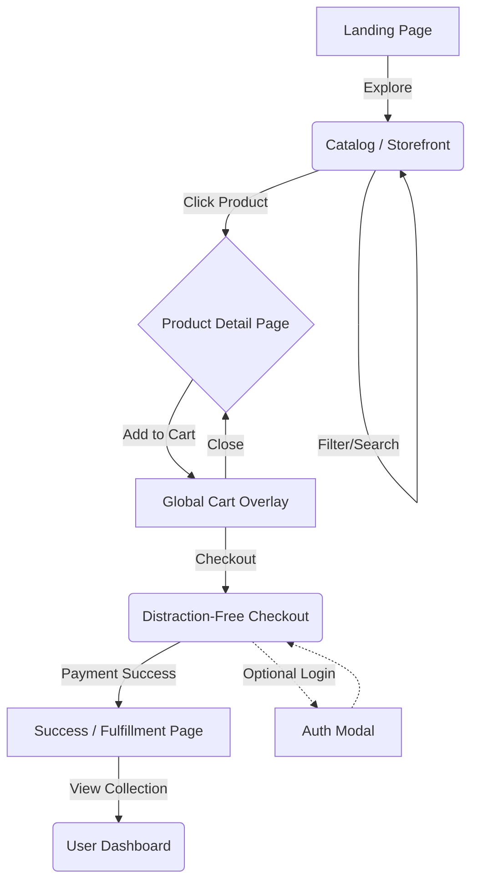

# UI/UX & Application Webflow

## 1. Design Philosophy
The UI/UX of HSR Digital Hub is strictly tailored to exude **luxury, craftsmanship, and performance**. We eschew generic UI patterns (e.g., standard Bootstrap cards, default Bento grids) in favor of:
- **Typographic Dominance:** Large, elegant serif headings (`Fraunces`) contrasted with highly legible, modern sans-serif body text (`Inter`).
- **Micro-Interactions:** Elements respond to user input with buttery-smooth CSS transitions using a custom easing curve: `cubic-bezier(0.16, 1, 0.3, 1)`.
- **Minimalist Complexity:** The UI appears clean and minimal at first glance, but reveals rich interactions (hover states, split-previews, parallax) upon engagement.

## 2. Core User Journeys (App Flow)

### 2.1 The Discovery Flow (Landing -> Catalog)
1. **Landing Page (Hero):** 
   - *Visual:* Full-bleed immersive background or split typography. 
   - *Action:* "Explore Collection" CTA drives the user smoothly into the catalog.
2. **The Catalog (Storefront):**
   - *Visual:* Dynamic, floating product cards. 
   - *Action:* Hovering over a product triggers a split-preview or auto-playing video/gif of the digital product.
   - *Interaction:* Instantaneous client-side filtering by category (Planners, Notion Templates, Toolkits) with zero page reloads.

### 2.2 The Evaluation Flow (Product Detail Page)
1. **Product Display:**
   - Deep dive into the product with a split-screen layout. Sticky product info on the right, scrolling rich-media gallery on the left.
2. **Trust & Proof:** 
   - Elegant typographic accordions for "What's Included", "Compatibility", and "Reviews".
3. **Action:**
   - Large, satisfying "Add to Collection" button with haptic/visual feedback (button morphs to a success state temporarily).

### 2.3 The Conversion Flow (Cart -> Checkout)
1. **Global Cart:**
   - Triggered via the nav bar. An elegant slide-out panel (drawer) or a floating frosted-glass overlay.
   - Shows line items, subtotal, and an immediate "Proceed to Checkout" action.
2. **Checkout Experience:**
   - A distraction-free, one-page checkout.
   - Form fields use floating labels and instant inline validation.
   - Seamless integration with the payment gateway.

### 2.4 The Fulfillment Flow (Post-Purchase -> Dashboard)
1. **Success State:**
   - Animated confirmation screen. 
   - Immediate generation of secure, time-limited download links for the digital assets.
2. **User Dashboard:**
   - Minimalist grid showing purchased items. 
   - "Download" and "View Invoice" actions.

## 3. Webflow / Interaction Mapping

## 4. Modern UI Innovations Implemented
- **Glassmorphism & Blurs:** Used sparingly on overlays and navbars (`backdrop-filter: blur(12px)`) to provide depth.
- **Scroll-Linked Animations:** Subtle parallax on hero elements to create a sense of physical space.
- **Optimistic UI Updates:** Adding to cart or favoriting an item updates the UI instantly, syncing with the server in the background via TanStack Query/tRPC.
